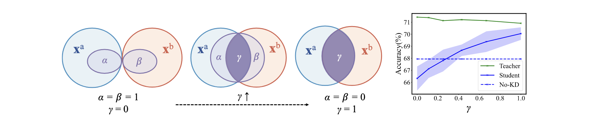
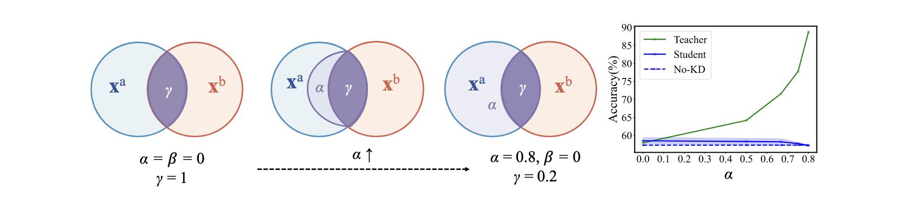
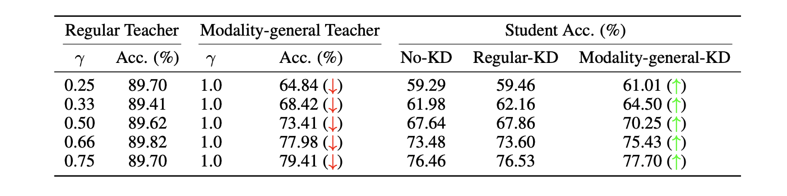
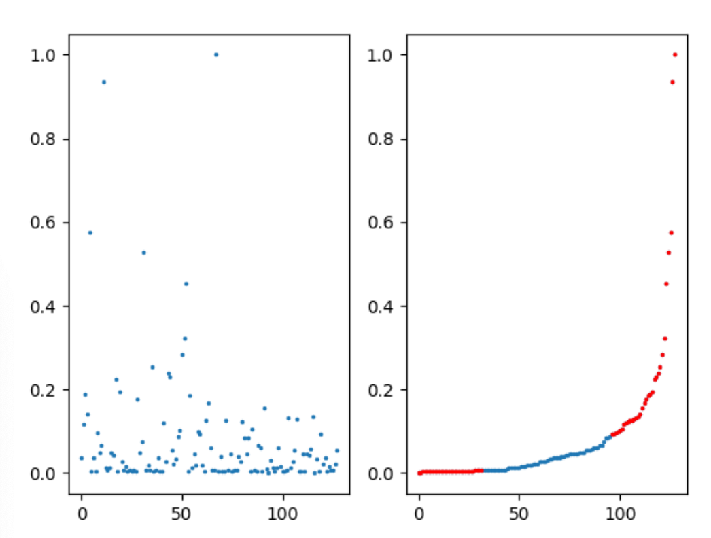

# The Modality Focusing Hypothesis

[**The Modality Focusing Hypothesis: Towards Understanding Crossmodal Knowledge Distillation**](https://openreview.net/forum?id=w0QXrZ3N-s)                                     
Zihui Xue, Zhengqi Gao, Sucheng Ren, Hang Zhao            
ICLR, 2023 (notable top-5%)  
[arXiv](https://arxiv.org/abs/2206.06487) | [website](https://zihuixue.github.io/MFH/index.html)

## Synthetic Gaussian
Go to directory `gauss`

(1) Use synthetic Gaussian data to gain intuition about MFH

[Figure 2 and 3 in the paper] Generate multimodal data (data generation inspired from [here](https://github.com/lopezpaz/distillation_privileged_information.git)), and apply cross-modal KD.


```shell
python main.py
```
Experiment 1: vary γ



Experiment 2: vary α



(2) Verify the implications of MFH
```shell
python main_modify_gamma.py
```

[Table 2 in the paper] Modify γ in data, and observe the performance differences of cross-modal KD.



Three modes: (a) baseline-randomly keep some feature channels in x<sub>1</sub>; 
(b) if the ground truth data generation way is known, only keep "modality-general decisive" features channels in x<sub>1</sub>;
(c) if the data generation process is unknown, use Algorithm 1 to rank features based on "modality-general decisive" information.

Modifying data results in different γ, we then re-apply cross-modal KD to observe the performance differences. 
For mode (b) and (c), we observe that: although teacher performance downgrades significantly, student performance does not get affected. 
This helps verify the MFH implication and our proposed Alg. 1 as well.

## RAVDESS Emotion Recognition

Go to directory `ravdess`

Dataset: [The Ryerson Audio-Visual Database of Emotional Speech and Song (RAVDESS)](https://zenodo.org/record/1188976#.YG6fBy8RrUo). 

Teacher modality: audio; Student modality: images.

We provide the data splits and pre-processed features [here](https://drive.google.com/drive/folders/1alZF_3UZtcmxa8yzTaKz7k3lxdOJykPn?usp=sharing). Save the folder as `ravdess/data`.

(1) [optional] use Algorithm 1 to calculate the salience of modality-general decisive information for each feature channel
```bash
python main_overlap_tag.py --place 5 --num-permute 10 --first_time --cal_tag
```
`--place` controls at which layer we input multimodal features to the algorithm. The default choice is 5, which corresponds to a feature dimension of 128.  
`--num-permute` controls the number of permutations, which corresponds to M in Algorithm 1.  
`--first-time` will first train the unimodal networks (i.e., step 1 in Algorithm 1).  

After training, the teacher checkpoint (`teacher_mod_1_overlap.pkl`) and saliency vector (`overlap_tag_teacher_place{place}_repeat{num_permute}.npy`) will be generated under the `./results` directory.  

In addition, we provide the results directory [here](https://drive.google.com/drive/folders/1739ua67F650D7Ei7f9WZ57l1adLkZgOV?usp=share_link). Save the folder as `ravdess/results` and skip this step.

Visualize the saliency vector.
```bash
python utils/helper.py
```


The saliency vector is normalized to be [0, 1]; a larger value indicates a more salient feature channel (i.e., this channel contains more modality-general decisive information).

(2) Verify MFH using the calculated saliency vector.
```bash
# Mode 0 - randomly remove 75% feature channels
python main_overlap_tag.py --ratio 0.75 --mode 0 --eval_tag

# Mode 1 - Modality-general KD: remove the top %r feature channels that have the least modality-general decisive info
python main_overlap_tag.py --ratio 0.75 --mode 1 --eval_tag

# Mode 2 - Modality-specific KD: remove the top %r feature channels that have the most modality-general decisive info
python main_overlap_tag.py --ratio 0.75 --mode 2 --eval_tag
```
The expectation is that modality-general KD (mode 1) will yield the best student network. 

## VGGSound Event Classification

Go to directory `vggsound`

Dataset: [VGG-Sound A large scale audio-visual dataset](https://www.robots.ox.ac.uk/~vgg/data/vggsound/). 

Teacher modality: audio; Student modality: video.

(1) Pretrain the audio teacher model and video model.
```bash
cd audio
python main_audio.py --train_dataset /path/to/vggsound/train --test_dataset /path/to/vggsound/test
# the pretrained checkpoint will be saved at "ckpt/audio_{}_{}.pt".format(epoch, test_acc)
cd ../video
python main_audio.py --train_dataset /path/to/vggsound/train --test_dataset /path/to/vggsound/test
# the pretrained checkpoint will be saved at "ckpt/audio_{}_{}.pt".format(epoch, test_acc)
cd ..
```

(2) Calculate the salience of modality-general/specific information for each feature channel.
```bash
cd modality_general
python cal_overlap_permute.py --train_dataset /path/to/vggsound/train --test_dataset /path/to/vggsound/test --a_ckpt /path/to/audio_pretrain.pth --v_ckpt /path/to/video_pretrain.pth
# The degree of "modality-general decisive" of each channel     audio_permute.npy
cd ..
```

(3) Verify MFH
```bash
cd mfh_kd
python -m torch.distributed.launch --nproc_per_node 2 python main.py --train_dataset /path/to/vggsound/train --test_dataset /path/to/vggsound/test --a_ckpt /path/to/audio_pretrain.pth
```


## Citing MFH
```
@inproceedings{xue2023modality,
      title={The Modality Focusing Hypothesis: Towards Understanding Crossmodal Knowledge Distillation},
      author={Xue, Zihui and Gao, Zhengqi and Ren, Sucheng and Zhao, Hang},
      booktitle={ICLR},
      year={2023}
}
```
